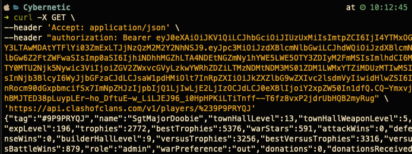

# Clash API Developers - Getting Started
## Table of Content
1. [Clash of Clans API](#1)
   1. [Interacting with CoC API](#1.1)
   2. [Some populate wrappers by language](#1.2)

## Clash of Clans API 
Clash of Clans has an official [API](https://developer.clashofclans.com/#/) with a developer console that you will 
have to register with. You can find their documentation [here](https://developer.clashofclans.com/#/documentation). 
The purpose of creating an account is to create a [JSON Web Token](https://jwt.io/introduction). 
These tokens are proof that you are authorized to request data from the CoC API endpoint. 
Therefore, every request you make to the API MUST have the token you created. 
This token is, however, tied to your public IP. If you created a token for your development workstation with IP A 
and then deploy your application to a server that has an IP of B. Then your request will be denied. 
You will need to create a token for each public IP you are interacting with the API. 

#### Querying without a JWT token

#### Querying with a JWT token

The above two images showcase what will happen if you skip creating a JWT and attempt to request data from the 
CoC API endpoint. You can find more examples on how to manually curl the API on the 
[CoC API documentation](https://developer.clashofclans.com/#/documentation) page.

### Interacting with CoC API 
Interacting with the CoC API endpoints using curl will not get you very far. 
You will need to interact with the API using whatever language you have chosen to interact with the API. 
The language you pick does not matter. Any modern language that supports sockets will allow you to interact with the API. 
But some languages are better suited for this purpose, especially the ones that already have libraries that 
developers have written to interact with the API. 

These CoC API libraries, or "wrappers" allow for quicker application creation. 
This is because you're not wasting time creating your wrapper. 
Another benefit of mature wrappers is the ability to abstract the HTTP get request patterns and model the data 
returned into an object that is better suited for the language used. 

### Some popular wrappers by language. 
#### Click on the language to get more information about it.
| Language                                                   | Link                                                                 | 
|------------------------------------------------------------|----------------------------------------------------------------------| 
| [Python](getting_started_subdir/getting_started_python.md) | [coc.py](https://github.com/mathsman5133/coc.py)                    | 
| C#                                                         | [CocAPI](https://github.com/devhl-labs/CocApi)                       |
| JS                                                         | [clashofclans.js](https://github.com/clashperk/clashofclans.js)      |
| Ruby                                                       | [clash_of_clans_api](https://github.com/expeehaa/clash_of_clans_api) |
| Ruby                                                       | [CocRB](https://github.com/Lycoon/clash-api)                         |
| Java                                                       | [clash-api](https://github.com/Lycoon/clash-api)                     |

